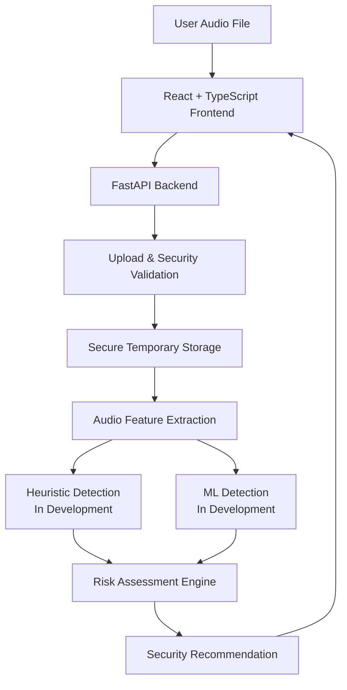

# Voice Clone Defense

**AI-Powered Real-Time Detection and Prevention of Voice Cloning Impersonation Attacks**

Voice Clone Defense is a Smart India Hackathon (SIH) prototype focused on identifying suspicious indicators in voice recordings that may be associated with synthetic or manipulated speech. The current V1 is an **uploaded-audio prototype**: an audio file is submitted through the application, validated by the backend, temporarily stored for processing, and analyzed for measurable audio characteristics. A separate detection-model integration is still in development.

> **Current status:** The repository is under active development. The current implementation provides the frontend upload experience, a FastAPI backend, audio feature extraction, upload/security controls, a risk-assessment layer, and automated backend testing/CI. The final ML/heuristic voice-cloning detection pipeline is **not yet integrated**.

## Problem Statement

Voice-cloning and synthetic-speech technologies can imitate trusted individuals and may be misused for social engineering, impersonation, and fraudulent requests. Voice Clone Defense is intended to help users examine a recording for suspicious indicators and receive a security-oriented assessment.

The system is designed as a decision-support tool. It should not be treated as absolute proof that a recording is genuine or synthetic.

## Objective

The V1 objective is to build a working uploaded-audio analysis flow that can:

1. Accept an audio recording.
2. Validate the uploaded file.
3. Preprocess and inspect the recording.
4. Extract measurable audio characteristics.
5. Pass structured evidence into a risk-assessment layer.
6. Present understandable analysis and security guidance.

The final authenticity/detection model is still being integrated. Until that work is complete, the application must not be described as a finished voice-cloning detector.

## Current Features

### Implemented

- React + TypeScript frontend with a Vite development/build setup.
- Audio-file upload flow in the frontend.
- Frontend loading, success, and error states.
- Backend FastAPI application.
- `POST /api/v1/analyze` analysis endpoint.
- Upload validation for supported audio extensions and MIME types.
- 25 MB upload-size enforcement.
- Secure temporary-file naming and temporary storage.
- Temporary audio-file cleanup after backend processing.
- Raw audio feature extraction including:
  - duration
  - sample rate
  - mean pitch when reliable
  - pitch variability when reliable
  - spectral flatness
  - silence ratio
  - insufficient-audio flag and analysis notes
- Risk-assessment model with LOW, MEDIUM, HIGH, and INSUFFICIENT_EVIDENCE levels.
- Explainable risk reasons and security recommendations in the risk layer.
- Backend tests for audio analysis, risk assessment, and integration/security behavior.
- GitHub Actions workflow for backend dependency installation and automated audio-analysis tests.

### In Development / Not Yet Integrated

- Final heuristic voice-cloning detection engine.
- Final ML-based synthetic-speech detector.
- Production evidence flow from real analysis/model outputs into the final risk score.
- Final end-to-end authenticity result in the frontend.
- Final confidence/result wording and model-backed explanation.

## System Architecture



The current codebase includes the architecture boundaries for security, audio analysis, and risk assessment. The heuristic and ML blocks shown above represent the intended V1 integration points and remain under development.

## Repository Structure

```text
voice-clone-defense/
├── .github/
│   └── workflows/
│       └── python-app.yml
├── backend/
│   ├── analysis/
│   │   └── audio_analyzer.py
│   ├── risk/
│   │   ├── README.md
│   │   ├── risk_engine.py
│   │   └── risk_models.py
│   ├── security/
│   │   └── file_security.py
│   ├── tests/
│   │   ├── test_audio_analyzer.py
│   │   ├── test_integration.py
│   │   └── test_risk_engine.py
│   ├── main.py
│   └── requirements.txt
├── frontend/
│   ├── public/
│   ├── src/
│   │   ├── assets/
│   │   ├── components/
│   │   ├── hooks/
│   │   ├── services/
│   │   ├── types/
│   │   ├── App.tsx
│   │   └── App.css
│   ├── package.json
│   └── package-lock.json
├── .gitignore
└── CLAUDE.md
```

## Technology Stack

### Frontend

- React
- TypeScript
- Vite
- ESLint

### Backend

- Python 3.12 (CI configuration)
- FastAPI
- Pydantic
- Uvicorn
- librosa
- NumPy
- SoundFile
- pytest

## Getting Started

### Prerequisites

Install the following before starting:

- Git
- Python 3.12 or a compatible recent Python installation
- Node.js and npm

### 1. Clone the repository

```bash
git clone https://github.com/arthurxmorgan16031863-hash/voice-clone-defense.git
cd voice-clone-defense
```

### 2. Set up the backend

From the repository root:

**Windows PowerShell:**

```powershell
python -m venv .venv
.\.venv\Scripts\Activate.ps1
pip install --upgrade pip
pip install -r backend/requirements.txt
```

**macOS/Linux:**

```bash
python3 -m venv .venv
source .venv/bin/activate
python -m pip install --upgrade pip
pip install -r backend/requirements.txt
```

Start the FastAPI server:

```bash
cd backend
uvicorn main:app --reload
```

The backend will normally be available at:

```text
http://127.0.0.1:8000
```

A health endpoint is defined by the current project milestone documentation, and the main analysis route is:

```text
POST /api/v1/analyze
```

### 3. Set up the frontend

Open a second terminal at the repository root:

```bash
cd frontend
npm ci
npm run dev
```

Vite will print the local development URL in the terminal.

## Using the Current Prototype

1. Start the backend.
2. Start the frontend.
3. Open the frontend in a browser.
4. Choose a supported audio file.
5. The frontend sends the recording to the backend analysis endpoint.
6. The current interface displays measured audio characteristics and clearly indicates when final detection is still pending.

Supported backend audio extensions currently include `.wav`, `.mp3`, `.flac`, `.ogg`, and `.m4a`. The frontend currently exposes WAV, MP3, M4A, and FLAC in its file picker. The backend enforces a 25 MB upload limit.

## API Overview

### `POST /api/v1/analyze`

Accepts an uploaded audio file using the `file` form field.

Current backend flow:

```text
Upload
  ↓
Security validation
  ↓
Secure temporary storage
  ↓
Risk-assessment pipeline
  ↓
Return assessment
  ↓
Delete temporary audio file
```

The current backend entry point uses placeholder heuristic/ML evidence values while the real detection engines are being integrated. Therefore, the current API response should not be interpreted as a validated production voice-cloning detection result.

## Testing

The repository contains backend tests covering the audio-analysis and risk components, as well as integration/security behavior.

Run the backend tests locally:

```bash
cd backend
python -m pytest tests -v
```

The GitHub Actions workflow currently runs on pushes and pull requests targeting `main`, installs the backend dependencies, and runs the audio-analyzer test suite.

Testing is still evolving alongside the remaining project modules. Additional tests should be added as the heuristic and ML engines are integrated.

## Security and Privacy

Security is treated as a core part of the prototype.

Current safeguards include:

- Allow-listing supported audio extensions.
- Checking uploaded MIME types when supplied.
- Rejecting unsafe filename paths.
- Enforcing a 25 MB upload limit.
- Using generated temporary filenames instead of trusting the original name for storage.
- Deleting the temporary audio file after processing.
- Keeping environment/secrets files out of version control through `.gitignore`.

Audio-processing code is intended to work on temporary files rather than retaining uploaded recordings unnecessarily.

## Known Limitations

The current repository should be understood as a development prototype, not a finished production detection platform.

- The final ML detector is not yet integrated.
- The final heuristic detector is not yet integrated.
- The current `main.py` still supplies mock heuristic/ML evidence to the risk engine.
- Audio feature extraction measures signal properties but does not itself determine whether speech is real or cloned.
- Detection quality, accuracy, false-positive rate, and false-negative rate have not been established by a final evaluation dataset in this repository.
- The final frontend authenticity result and model-backed explanation remain pending integration.
- Live/near-live telephony or VoIP processing is outside the current V1 implementation.

## Future Direction

The project architecture is intended to support later expansion after V1 is stable. Planned directions include:

- Live or near-live audio streams.
- VoIP and telephony integration.
- Context-aware enrichment.
- Configurable risk thresholds and alerts.
- Multilingual and accent-aware analysis.
- Privacy-preserving or edge inference.
- Banking, enterprise, and telecom integrations.
- Additional API/SDK interfaces.

These are roadmap items and are **not part of the current implemented V1** unless they are explicitly added later.

## Contributing

1. Create a feature branch from `main`.
2. Make one focused change at a time.
3. Run the relevant tests and checks locally.
4. Update documentation when behavior or setup changes.
5. Open a pull request with a clear description of what changed and why.
6. Do not commit secrets, local virtual environments, generated build output, or uploaded audio files.

Before declaring a feature complete, verify that implementation, testing, edge cases, and relevant documentation are all up to date.

## Project Status

**Current project stage:** Phase 0.2 / early V1 development.

The repository already contains the project instructions, backend foundation, security layer, audio feature extraction, risk-assessment layer, frontend foundation, tests, and CI workflow. The remaining major V1 work is integrating the real heuristic and ML detection components and wiring their evidence into the final user-facing assessment.

The project is being developed toward the working SIH prototype scope defined in `CLAUDE.md`.

## License

No repository license file is currently declared. Licensing should be added separately if the team decides to publish the project under an open-source license.
